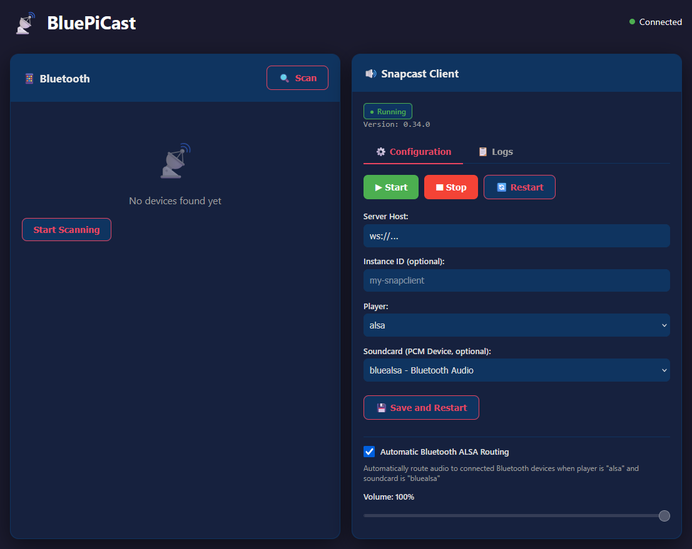

<div align="center">

# BluePiCast

**A lightweight web-based toolkit to proxy Snapcast audio to Bluetooth/ALSA/Pipewire.**

**Works on Raspberry Pi 3+, 4, 5, Zero 2 W.**

</div>

<div align="center">



</div>

## Features

- Nice Web UI
- Get your audio stream from a Snapcast server
- Route it automatically to an ALSA/Pipewire device, or to a Bluetooth device using BlueALSA

## Requirements

- Raspberry Pi 3+, 4, 5, Zero 2 W, or newer (built-in Bluetooth)
- Raspberry Pi OS (or any Linux with BlueZ)
- BlueZ Bluetooth stack (pre-installed on Raspberry Pi OS)

## Install Script

Install on your existing Raspberry Pi OS with a single command:

```bash
curl -sSL https://raw.githubusercontent.com/Ilshidur/bluepicast/main/install.sh | sudo bash
```

Access the web interface at `http://<raspberry-pi-ip>:8080`

## Uninstall script

```bash
curl -sSL https://raw.githubusercontent.com/Ilshidur/bluepicast/main/uninstall.sh | sudo bash
```

## Important notes

> **Warning**  
> This project has been heavily “vibe coded” and largely generated with AI tools (such as GitHub Copilot). Expect rough edges, unusual design choices, and incomplete features. Issues and pull requests are very welcome.

## TODO

- Provide a Raspberry Pi image along the executables in each release note

## License

MIT License - see [LICENSE](LICENSE) for details.

## Contributing

Contributions are welcome! Please feel free to submit a Pull Request.
